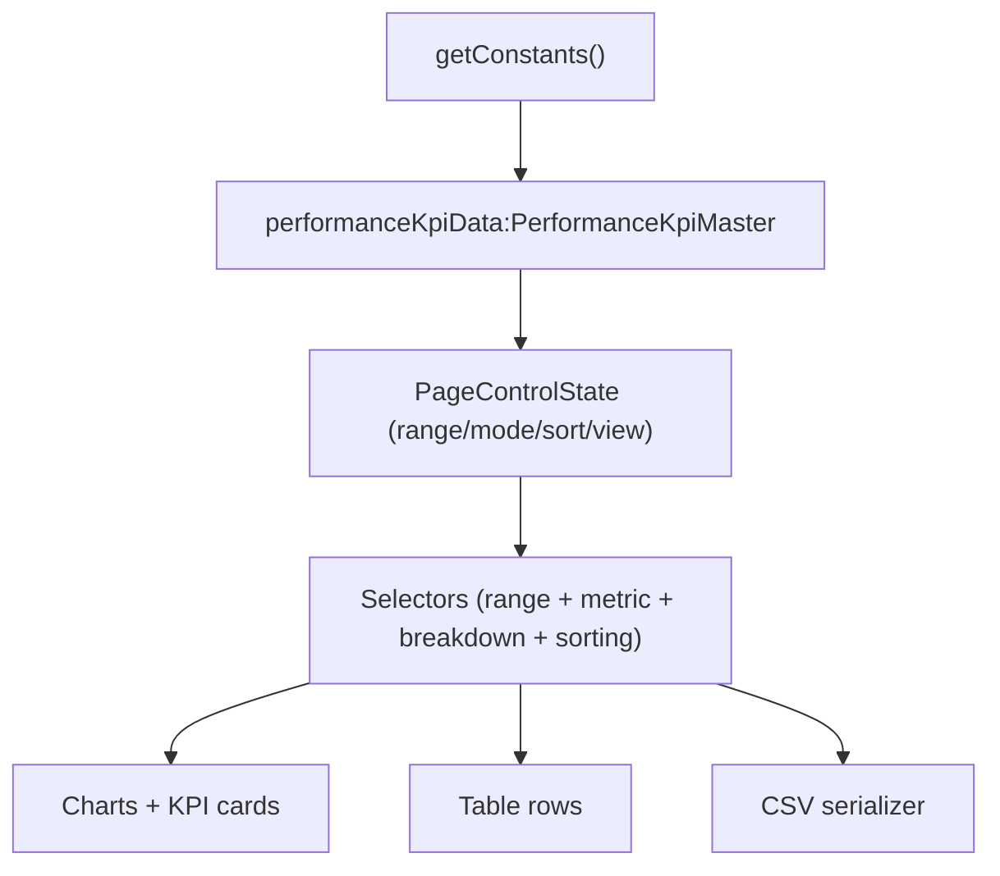

# Performance Page Implementation Plan

## Outcome

Deliver a bespoke, usability-first `/performance` experience that is dynamic and data-rich, while remaining calm and scannable: white primary background, consistent color language, 12-column alignment, filterable views, and CSV download.

## Key Principles (applied throughout)

- White-first readability: default section backgrounds are white (`bg-white`) with restrained accent surfaces only where needed.
- Progressive disclosure: show essential KPIs first; deeper breakdowns are opt-in.
- One interaction model: a single global page-level control bar drives all charts/tables.
- Consistent visual identity: reuse existing SOGIF chart colors and typography.
- No clutter: concise labels/help text, minimal legal/disclaimer footprint on this page.
- Controls must feel obvious at a glance: visual active states, compact labels, and one-click reset.

## Files To Implement / Extend

- Route page shell and section composition: [app/performance/page.tsx](app/performance/page.tsx)
- Performance feature components (new folder): [components/performance/](components/performance/)
  - `PerformanceFilterBar.tsx`
  - `PerformanceKpiStrip.tsx`
  - `PerformanceTrendPanel.tsx`
  - `AllocationExplorer.tsx`
  - `BreakdownExplorer.tsx`
  - `PerformanceDataTable.tsx`
  - `PerformanceCsvExport.tsx`
- KPI selectors/filters (pure helpers): [lib/calculations/](lib/calculations/)
  - `performance-filters.ts`
  - `performance-export.ts`
- Existing source data pipeline (reuse, no structural rewrite): [lib/queries/constants.ts](lib/queries/constants.ts), [lib/types/datocms.ts](lib/types/datocms.ts)
- Optional docs update for page-specific design usage: [docs/design-system.md](docs/design-system.md)

## Page Information Architecture

1. Hero/Header (compact)

- Page title + short purpose statement
- “Data as of {latest month}” and date range from `performanceKpiData.dateRange`

2. Global Filter Bar (sticky on scroll)

- Presets: All, YTD, 12M, 6M
- Custom month range picker (bounded by available data)
- Metric mode toggle where relevant (`%` vs `$`)
- Global sort control (`Latest → Oldest` / `Oldest → Latest`) that affects table + month-based chart ordering where applicable
- Breakdown sort control (`Value`, `A-Z`) for ranked bars/tables
- View-density control (`Simple` / `Detailed`) to reduce overwhelm for first-time users
- Reset filters action
- CSV Download action (exports current filtered view)

### Page-Level Control Behavior

- Single source of truth in one control state object; no section-local filter conflicts.
- Sticky bar remains visible after first scroll to avoid “lost controls”.
- Show active control chips under the bar (e.g., `12M`, `%`, `Value sort`) with `x` to remove individually.
- Add `Clear all` as a high-visibility fallback.
- All controls update URL query params for shareable states and back/forward usability.
- Debounce expensive updates and memoize selectors for smooth interaction.

3. KPI Snapshot Strip (latest vs selected period)

- `FUM`, `NTA`, `Issue Price`, `Redemption Price`, `Distribution`
- Delta indicators vs prior period (or first in selected range)
- Null-safe display for optional redemption values

4. Trend Panel (single primary chart area)

- Main timeline (issue/redemption/NTA/distribution variants)
- Optional compare toggle (off by default to reduce complexity)
- Clear legend and restrained annotations

5. Allocation Explorer

- Asset allocation over time (cash/efficient/inefficient)
- Current-period composition card
- Click-to-focus category interactions

6. Breakdown Explorer (tabbed)

- Efficient split (manager/type)
- Inefficient split (state/industry/location)
- One active tab at a time to prevent cognitive overload

7. Data Table + Export

- Sortable compact table for filtered monthly rows
- Column visibility defaults to core fields, advanced columns hidden behind toggles
- CSV export respects active filters and visible mode

## Data & State Architecture

- Reuse `performanceKpiData.monthlySeries` and `timeSeries` as source-of-truth.
- Add pure memo-friendly selectors in `lib/calculations/performance-filters.ts`:
  - range filtering by `sortKey`
  - period comparison helpers
  - breakdown shaping for chart/table formats
  - unified sorting helpers for timeline and category views
- Add CSV shaping + escaping utilities in `lib/calculations/performance-export.ts`.

## UX/Visual System Decisions

- Grid and layout: use `grid grid-cols-12` section wrappers with `col-span-*` breakpoints; avoid simplified section-level grids.
- Spacing rhythm: `section-padding`, `mb-12`/`mb-16`, and approved gap scale (`gap-8`, `lg:gap-12`) per design system.
- Color scheme: keep existing metric mapping from home performance chart (cyan/gold/success) and neutral greys for support series.
- Background strategy:
  - Page + primary sections: white
  - Cards: white with subtle border/shadow
  - Avoid dark-block chart sections on this page unless required for contrast/accessibility.
- Typography: keep chart labels/ticks concise and consistent with current type classes.

## CSV Download Scope

- Export includes:
  - filtered month range
  - active sort and view mode context
  - core KPI columns always
  - active breakdown columns based on current tab/view
- Filename convention: `sogif-performance-{startMonth}-to-{endMonth}.csv`
- Include one metadata row in-app (not in file) describing active filters to avoid cluttering CSV.

## Delivery Phases

1. Foundation

- Create route + page scaffold + filter state model
- Implement global filter bar and KPI strip

2. Core analytics

- Implement trend panel and allocation explorer wired to selectors
- Add breakdown tabs with one active deep-dive view

3. Data utility + table

- Implement compact table with sort
- Add CSV export for filtered dataset

4. Polish and hardening

- Accessibility pass (keyboard order, focus states, color contrast, aria labels)
- Mobile pass (single-column sequence, control density)
- Empty/null/loading states and copy tightening

## Acceptance Criteria

- White-first page with consistent identity and no visual overload.
- All major views update from one page-level control state.
- Users can understand current performance in <30 seconds (snapshot + trend).
- Deep dives are available but hidden behind tabs/toggles.
- Sorting/filtering controls are visually obvious, keyboard accessible, and require minimal learning.
- CSV export works for current filtered view.
- Section layouts follow 12-column system and approved spacing/color conventions.
